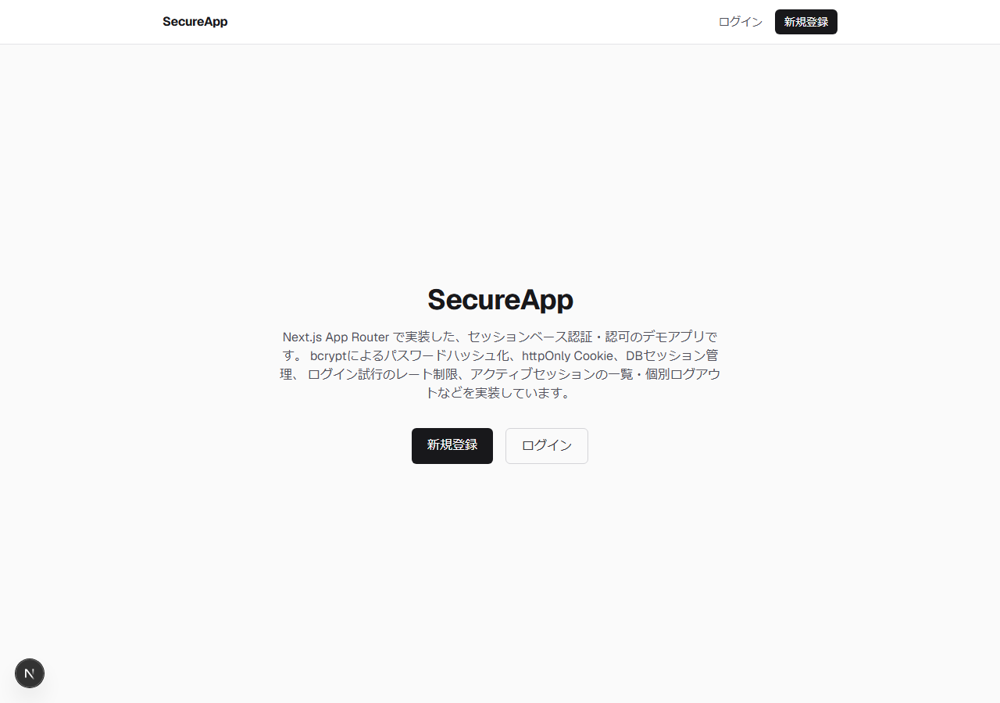
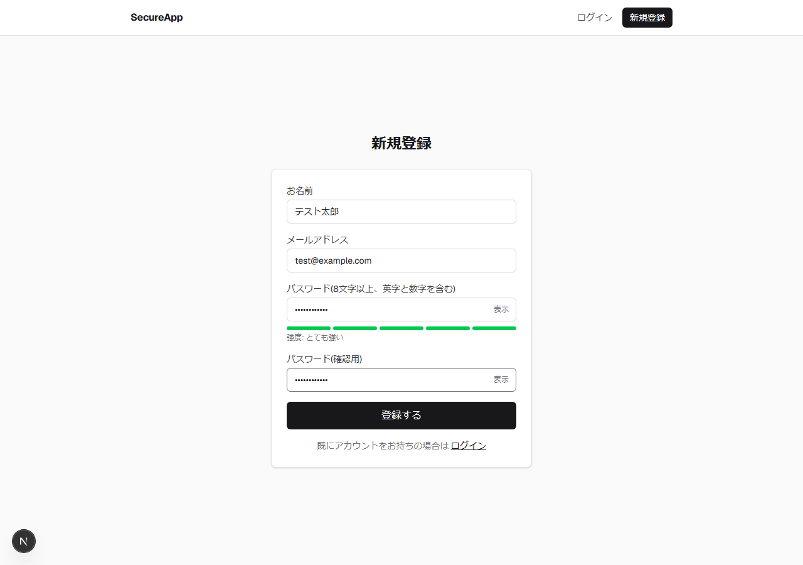
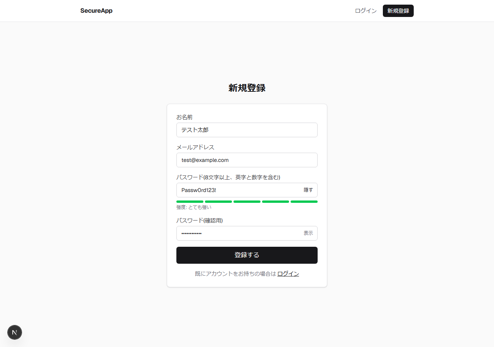
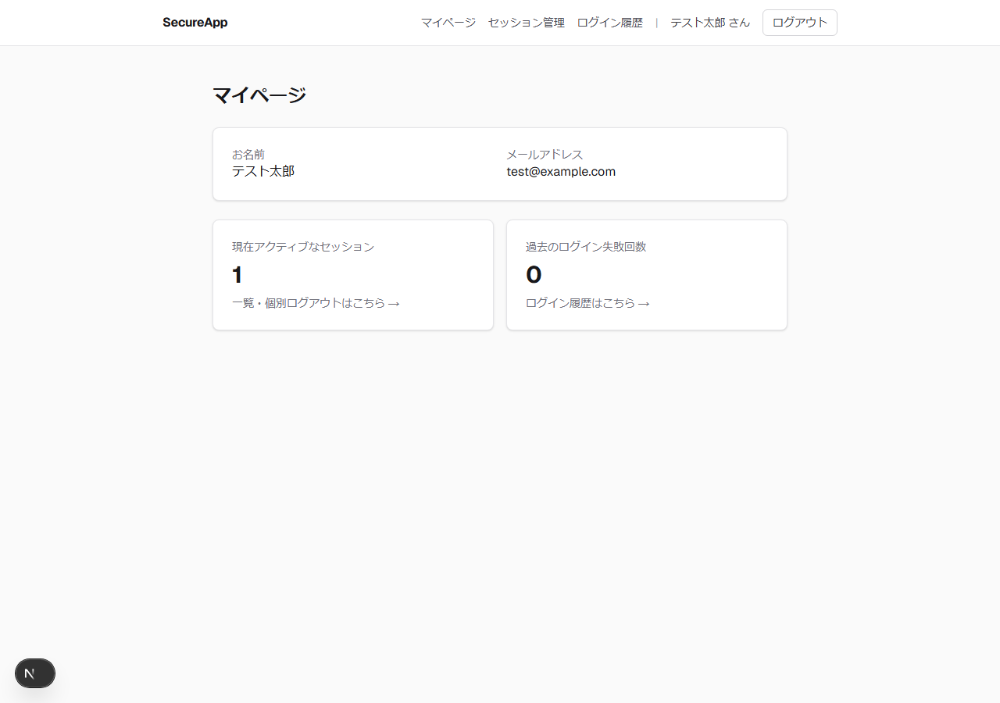
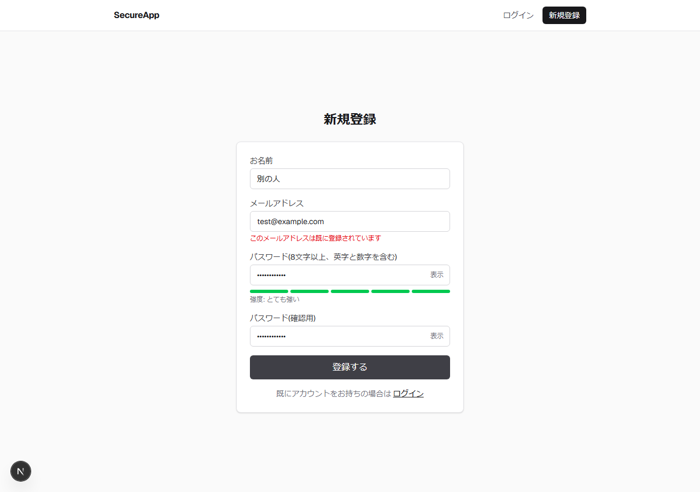
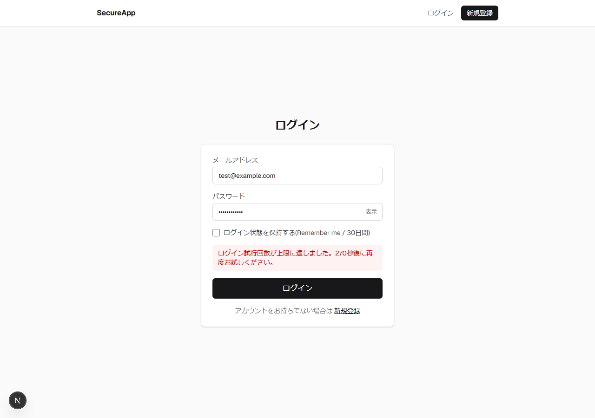
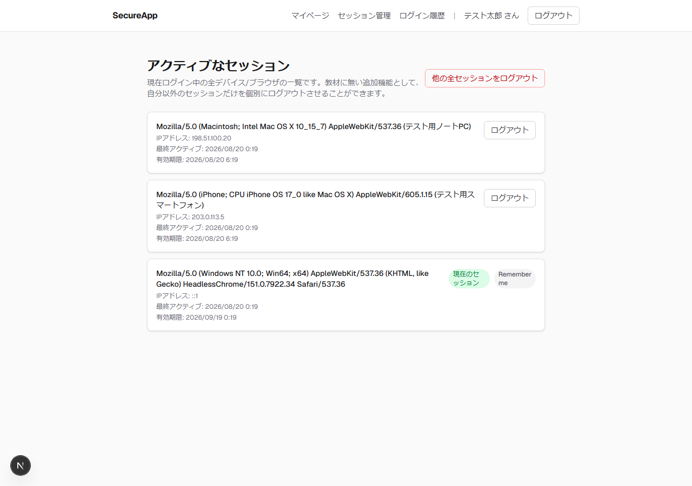
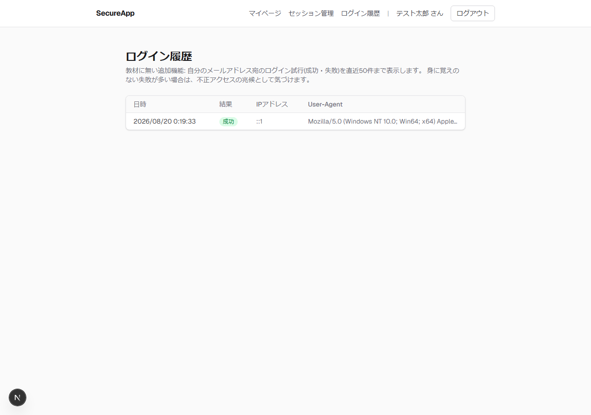

# SecureApp

Next.js (App Router) で実装した **セッションベース認証・認可** のデモアプリです。
知能情報実験実習2「実装課題2」への提出物として、[web-sec-playground-2の教材](https://takeshiwada1980.github.io/Eii2-2026/security02b.html) で扱われたセキュリティのベストプラクティス(bcrypt、Cookie属性、CSPなど)を踏まえつつ、教材には無い認証・認可関連機能を **4つ** 追加実装しています。

> 教材(`web-sec-playground-2`)をベースにはせず、**新規にスクラッチ実装**しています。理由は「[web-sec-playground-2をベースにしなかった理由](#web-sec-playground-2をベースにしなかった理由)」を参照してください。

---

## 目次

- [デモ画面](#デモ画面)
- [認証方式: なぜセッションベースか](#認証方式-なぜセッションベースか)
- [認可(Authorization)の実装](#認可authorizationの実装)
- [教材に無い追加実装機能(4つ)](#教材に無い追加実装機能4つ)
- [セキュリティ対策一覧](#セキュリティ対策一覧)
- [技術スタック](#技術スタック)
- [ディレクトリ構成](#ディレクトリ構成)
- [セットアップ手順](#セットアップ手順)
- [web-sec-playground-2をベースにしなかった理由](#web-sec-playground-2をベースにしなかった理由)
- [既知の制限・今後の課題](#既知の制限今後の課題)

---

## デモ画面

すべて実際にアプリを動かして撮影したスクリーンショットです([Playwright](https://playwright.dev/)でE2E的に操作し撮影)。

| | |
|---|---|
|  **① トップページ** |  **② 新規登録: パスワード強度メーター** |
|  **③ パスワードの表示/非表示切替** |  **④ マイページ** |
|  **⑤ メールアドレス重複時のエラー(入力値も保持)** |  **⑥ ログイン試行のレート制限発動時** |
|  **⑦ アクティブセッション一覧・個別ログアウト** |  **⑧ ログイン履歴** |

---

## 認証方式: なぜセッションベースか

教材で紹介されている「セッションベース認証」と「トークンベース認証(JWT)」のうち、本アプリは **セッションベース認証** を採用しました。

```
[1] ログイン成功
     ブラウザ ──POST /login(email, password)──▶ Server Action(login)
                                                   │ bcrypt.compare()
                                                   │ ランダムな256bitトークンを生成
                                                   │ そのSHA-256ハッシュ値のみをSessionテーブルに保存
                                                   ▼
     ブラウザ ◀── Set-Cookie: session_token=<生トークン> (httpOnly, secure, sameSite=lax) ──

[2] 以降のリクエスト
     ブラウザ ──Cookie: session_token=<生トークン>──▶ requireUser() / verifySession()
                                                        │ トークンをSHA-256でハッシュ化
                                                        │ Sessionテーブルをハッシュ値で検索
                                                        │ revokedAt / expiresAt をチェック
                                                        ▼
                                                   有効ならユーザー情報を返す

[3] ログアウト
     ブラウザ ──POST /logout──▶ Server Action(logout)
                                  │ Sessionレコードに revokedAt を設定(物理削除ではなく失効扱い)
                                  ▼
     ブラウザ ◀── Set-Cookie: session_token=; Max-Age=0 ──
```

選定理由:

1. **サーバー側で能動的に無効化できる** ― JWTと違い、DBのセッションレコードを失効させるだけで即座にログアウトさせられる。これが追加機能「②アクティブセッションの一覧表示・個別ログアウト」を実現するための前提になっている。
2. **Cookieに載る情報が最小限** ― Cookieには生トークンしか入っておらず、ユーザー情報やロールはサーバー側(DB)に保持される。ペイロードを解析されても中身が漏れない。
3. **セッションIDはハッシュ化してDB保存** ― `crypto.randomBytes(32)` で生成した生トークンをCookieに渡し、DBには **SHA-256ハッシュ値のみ** を保存する([src/lib/session.ts](src/lib/session.ts))。万一DBの中身が漏洩しても、生トークンを復元できないため、Cookieを盗まない限りセッションを乗っ取れない。

実装は `NextAuth` 等のライブラリに頼らず、Next.js公式ドキュメントの [Authentication guide](https://nextjs.org/docs/app/guides/authentication)(Data Access Layerパターン)に沿ってスクラッチで実装しました。認証の仕組み自体を理解していることを示す目的です。

---

## 認可(Authorization)の実装

2段階でチェックしています(Next.js公式が推奨する「楽観的チェック + 確実なチェック」の二段構え)。

1. **楽観的チェック(`src/proxy.ts`)**
   Next.js 16では `middleware.ts` が `proxy.ts` に名称変更されました。ここではCookieの **有無だけ** を見て、未ログインで `/mypage` 配下にアクセスした場合は `/login` にリダイレクトします。DBアクセスはしません(全リクエストで実行されるため高速に保つ)。
2. **確実なチェック(`src/lib/dal.ts` の `requireUser()`)**
   実際にDBのSessionレコードを検証し、失効・期限切れでないかを確認します。すべてのマイページ・Server Actionはこの関数を経由してからデータにアクセスします。Proxyだけに認可を委ねず、データソースに近い場所で必ず検証する、というNext.js公式のDALパターンを踏襲しています。

さらに、セッション個別ログアウトAPI(`revokeSessionAction`)では、操作対象のセッションが **操作しているユーザー自身のものか** を必ず検証しており、他人のセッションを勝手に切断できないようになっています([src/app/actions/sessions.ts](src/app/actions/sessions.ts))。

---

## 教材に無い追加実装機能(4つ)

課題要件の「2つ以上」に対し、**セッションのセキュリティ監査** というテーマで一貫させた4つの機能を実装しました。

### ① ログイン試行の間隔制限(レートリミット)

[src/lib/rateLimit.ts](src/lib/rateLimit.ts)

- 同一メールアドレスへの直近10分間の失敗が5回を超えると、5分間ログインを拒否します(⑥のスクリーンショット参照)。
- **正しいパスワードを入力してもロック中は弾かれる** ため、ブルートフォース攻撃対策として機能します(実際に検証済み)。
- 同一IPアドレスからの広範囲な総当たり(複数アカウントへの攻撃)も緩和するため、IP単位でも閾値を設けています。

### ② 現在アクティブなセッションの一覧表示と個別ログアウト

[src/app/mypage/sessions/page.tsx](src/app/mypage/sessions/page.tsx) / [src/app/actions/sessions.ts](src/app/actions/sessions.ts)

- ログイン中の全デバイス/ブラウザを、User-Agent・IPアドレス・最終アクティブ日時・有効期限付きで一覧表示します。
- 自分以外のセッションだけを選んでログアウトさせる、または「他の全セッションをログアウト」で一括失効できます。
- セッションベース認証(DBで能動的に管理できる)を選んだからこそ実現できる機能です。

### ③ サインアップ時のパスワード強度表示

[src/lib/passwordStrength.ts](src/lib/passwordStrength.ts) / [src/components/PasswordField.tsx](src/components/PasswordField.tsx)

- 長さ・大文字小文字・数字・記号の組み合わせを見て5段階のバーとラベルをリアルタイム表示します。
- 加えて、パスワードの表示/非表示切り替えと、確認用パスワード入力(誤入力防止)も実装しています。

### ④ ログイン履歴の表示

[src/app/mypage/history/page.tsx](src/app/mypage/history/page.tsx)

- 自分のメールアドレス宛のログイン試行(成功・失敗)を直近50件、日時・IPアドレス・User-Agent付きで表示します。
- 身に覚えのない失敗が続いていれば、不正アクセスの兆候にユーザー自身が気づけます。①のレート制限と同じ `LoginAttempt` テーブルを再利用しています。

---

## セキュリティ対策一覧

| 対策 | 実装箇所 | 備考 |
|---|---|---|
| パスワードのハッシュ化 | [src/lib/password.ts](src/lib/password.ts) | `bcryptjs`、コストファクター12。ネイティブ`bcrypt`はWindows等でのビルド依存を避けるため不採用(ハッシュ形式は`$2a$`/`$2b$`互換で同一)。 |
| セッションCookieの属性 | [src/lib/session.ts](src/lib/session.ts) | `httpOnly`(JSからアクセス不可)・`secure`(本番のみ)・`sameSite=lax`・`path=/`。 |
| セッションIDの保存方法 | [src/lib/session.ts](src/lib/session.ts) | 生トークンはCookieのみ、DBにはSHA-256ハッシュ値のみを保存(漏洩時の再利用を防止)。 |
| CSP(Content Security Policy) | [src/proxy.ts](src/proxy.ts) | リクエストごとに乱数nonceを発行し `script-src 'self' 'nonce-...' 'strict-dynamic'` を設定。`'unsafe-inline'`を使わないため、万一XSSでスクリプトを注入されてもnonceを知らない攻撃者コードは実行できない。開発時のみReactのデバッグ用に`'unsafe-eval'`を許可。 |
| その他のセキュリティヘッダー | [src/proxy.ts](src/proxy.ts) | `X-Content-Type-Options: nosniff`、`X-Frame-Options: DENY`、`Referrer-Policy: strict-origin-when-cross-origin`。 |
| 入力バリデーション | [src/lib/validation.ts](src/lib/validation.ts) | Zodでメール形式・パスワード強度(8文字以上、英数字必須)等をサーバー側で必ず検証。 |
| ログイン失敗時のメッセージ統一 | [src/app/actions/auth.ts](src/app/actions/auth.ts) | 「メールアドレスが存在しない」と「パスワードが違う」を区別せず、アカウントの存在有無を推測させない。 |
| ブルートフォース対策 | [src/lib/rateLimit.ts](src/lib/rateLimit.ts) | 追加機能①(レートリミット)。 |
| CSRF対策 | Server Actions全般 | Next.jsのServer ActionsはデフォルトでOriginヘッダー検証を行うため、外部サイトからのフォーム送信を拒否する。 |
| 認可の二重チェック | [src/proxy.ts](src/proxy.ts) / [src/lib/dal.ts](src/lib/dal.ts) | 「認可(Authorization)の実装」の章を参照。 |
| セッション所有者チェック | [src/app/actions/sessions.ts](src/app/actions/sessions.ts) | 他人のセッションを失効させられないことを確認済み。 |

---

## 技術スタック

- **Next.js 16**(App Router / Turbopack) + TypeScript
- **Prisma 7** + SQLite(`@prisma/adapter-better-sqlite3`)
- **bcryptjs** ― パスワードハッシュ化
- **Zod** ― 入力バリデーション
- **Tailwind CSS 4**
- 認証・セッション管理は外部ライブラリ(NextAuth等)を使わず **スクラッチ実装**

> **補足**: Next.js 16ではミドルウェアが `middleware.ts` → `proxy.ts` に名称変更、`cookies()`/`headers()`の同期アクセスが廃止(完全非同期化)されるなど、破壊的変更があります。Prisma 7でもSQLite利用時にドライバアダプタ(`@prisma/adapter-better-sqlite3`)が必須になるなど仕様が変わっています。本プロジェクトはいずれも最新の公式ドキュメント(パッケージに同梱されている`node_modules/next/dist/docs`等)を確認した上で、現行の推奨パターンに沿って実装しています。

---

## ディレクトリ構成

```
src/
  app/
    page.tsx                  # トップページ
    login/                    # ログインページ(Server Action: login)
    signup/                   # 新規登録ページ(Server Action: signup)
    mypage/
      page.tsx                # プロフィール・概要
      sessions/page.tsx        # ①②の画面(セッション一覧・個別ログアウト)
      history/page.tsx         # ④の画面(ログイン履歴)
    actions/
      auth.ts                 # signup / login / logout の Server Actions
      sessions.ts              # セッション個別失効 / 一括失効の Server Actions
  lib/
    prisma.ts                 # Prisma Clientシングルトン
    session.ts                 # セッション生成・検証・失効(DBハッシュ保存)
    password.ts                 # bcryptラッパー
    passwordStrength.ts          # パスワード強度スコアリング(クライアントからも呼べる純粋関数)
    rateLimit.ts                 # 追加機能①(ログイン試行レート制限)
    validation.ts                 # Zodスキーマ
    dal.ts                        # requireUser() (Data Access Layer)
    request.ts                     # クライアントIP取得ユーティリティ
  components/
    PasswordField.tsx          # 表示/非表示切替 + 強度メーター
    SubmitButton.tsx            # useFormStatusによる送信中表示
  proxy.ts                     # 旧middleware.ts。楽観的な認可チェック + CSP等のヘッダー付与
prisma/
  schema.prisma                # User / Session / LoginAttempt
docs/screenshots/              # README用スクリーンショット
```

---

## セットアップ手順

```bash
npm install
cp .env.example .env
npx prisma migrate dev
npm run dev
```

`http://localhost:3000` でアクセスできます。SQLiteのため、追加のDBサーバーや環境変数の共有は不要です。

---

## web-sec-playground-2をベースにしなかった理由

課題要件では「web-sec-playground-2をベースに開発する場合、使用しない認証方式のコードやニュース・ショップ機能を全て削除しないと減点」とされています。今回は該当機能(ニュース/ショップ、JWT方式のコード)を一切含まない **新規スクラッチ実装** とすることで、この減点リスクを構造的に回避しました。教材で示されているセキュリティのベストプラクティス(bcrypt、Cookie属性、CSP、Zod、Prismaなど)は踏襲しています。

---

## 既知の制限・今後の課題

- パスワード強度の判定は長さ・文字種のみを見る簡易ヒューリスティックであり、`zxcvbn`のような辞書攻撃耐性の評価は行っていません。
- レート制限はDBの`LoginAttempt`テーブルを都度集計する実装のため、大規模トラフィックでは Redis 等を使ったカウンタ方式の方が高速です(学習用途のスコープでは許容範囲と判断しました)。
- メール送信機能が無いため、パスワードリセット・メールアドレス確認機能は未実装です。
